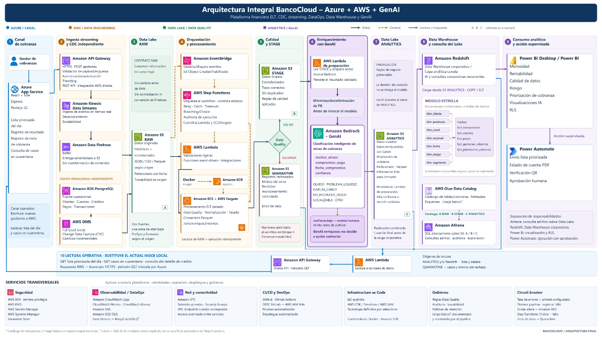

# Slide — Análisis de seguridad (1 lámina)

> Lámina individual: lo que se muestra, lo que se dice (~1 min) y de dónde sale cada punto.
> Imagen fuente: `docs/parte_victor.jpg` (arquitectura integral, franja inferior «Servicios transversales → Seguridad»).

## Lo que se muestra

> En la lámina, recortar solo el recuadro **Seguridad** de la franja «Servicios transversales»:
> AWS IAM (mínimo privilegio) · AWS KMS · Secrets Manager · Systems Manager · Parameter Store.

## Lo que se dice

> «La seguridad está en dos niveles. A nivel plataforma, lo que se ve en el diagrama de Victor: IAM con mínimo privilegio, cifrado con KMS, secretos en Secrets Manager y Parameter Store, nada hardcodeado. Y a nivel dato, lo que ya está implementado en la base: RLS para que cada cliente vea solo sus filas, DNI con hash para buscar y cifrado con pgcrypto para recuperar según la Ley 29733, auditoría forense inmutable, y el front escribiendo en el lago Bronze, nunca en las tablas de dinero.»

## Las 3 capas implementadas (tabla de la lámina)

| Capa | Qué hay | Dónde se comprueba |
|---|---|---|
| Acceso por filas (RLS) | SELECT/INSERT/UPDATE propios en clientes, cuentas y transacciones | `test_07_rls.sql` → `PASSED: A ve solo lo suyo e INSERT ajeno bloqueado` |
| Datos personales (PII) | `dni_hash` HMAC-SHA256 + `dni_cifrado` pgcrypto, clave fuera del repo | `demo_dni_autorizado.sql` / `demo_dni_no_autorizado.sql` |
| Auditoría + ingesta | Trigger forense OLD/NEW en JSONB, `REVOKE UPDATE,DELETE` en `audit_logs`; app → Bronze, no toca saldos ni ledger | `trg_audit_transacciones_forense`, `src/api.js` (`x-api-key`) |

## Frase de cierre

> «El secreto del demo vive en el código solo porque el repo es de curso y está marcado como la vulnerabilidad que demostramos; en el banco vive en Parameter Store con KMS y rotación.»

## Transición

> «Con el dato protegido, volvemos a lo que el jurado ve: la lista de mañana.»
